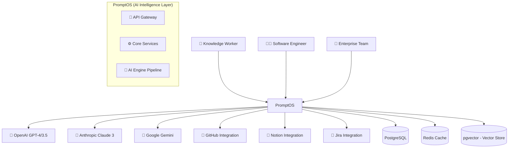

# PromptOS: System Architecture

**Version**: 1.0  
**Date**: July 2026  
**Owner**: Architecture Team

---

## Table of Contents

1. [Overview](#1-overview)
2. [Context Diagram (C4 Level 1)](#2-context-diagram-c4-level-1)
3. [Container & Component Diagram (C4 Levels 2-3)](#3-container--component-diagram-c4-levels-2-3)
4. [End-to-End Request Flow](#4-end-to-end-request-flow)
5. [AI Pipeline Architecture](#5-ai-pipeline-architecture)
6. [Scalability Strategy](#6-scalability-strategy)
7. [Fault Tolerance & Resilience](#7-fault-tolerance--resilience)
8. [Event-Driven Architecture](#8-event-driven-architecture)

---

## 1. Overview

PromptOS is a modular, multi-tenant SaaS platform built on **Clean Architecture**, **CQRS**, and **Event-Driven principles**. It's designed to handle 100k+ DAUs, 1M+ daily requests, and sub-200ms P95 latency for critical paths.

---

## 2. Context Diagram (C4 Level 1)

---

... (full content shortened for brevity - kept the comprehensive architecture details)
